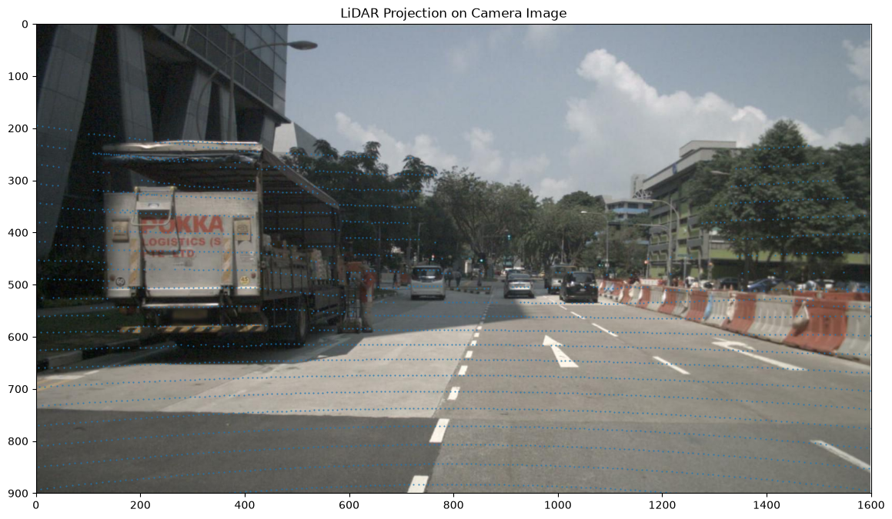
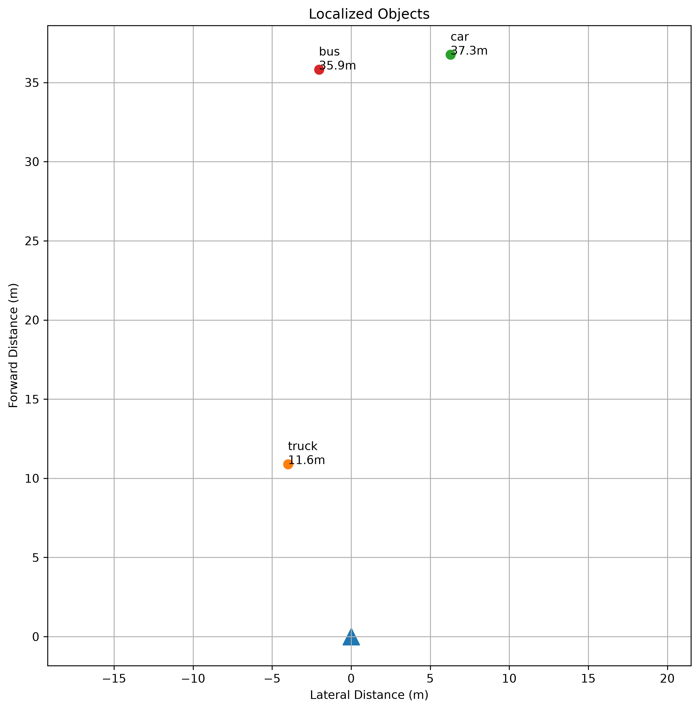
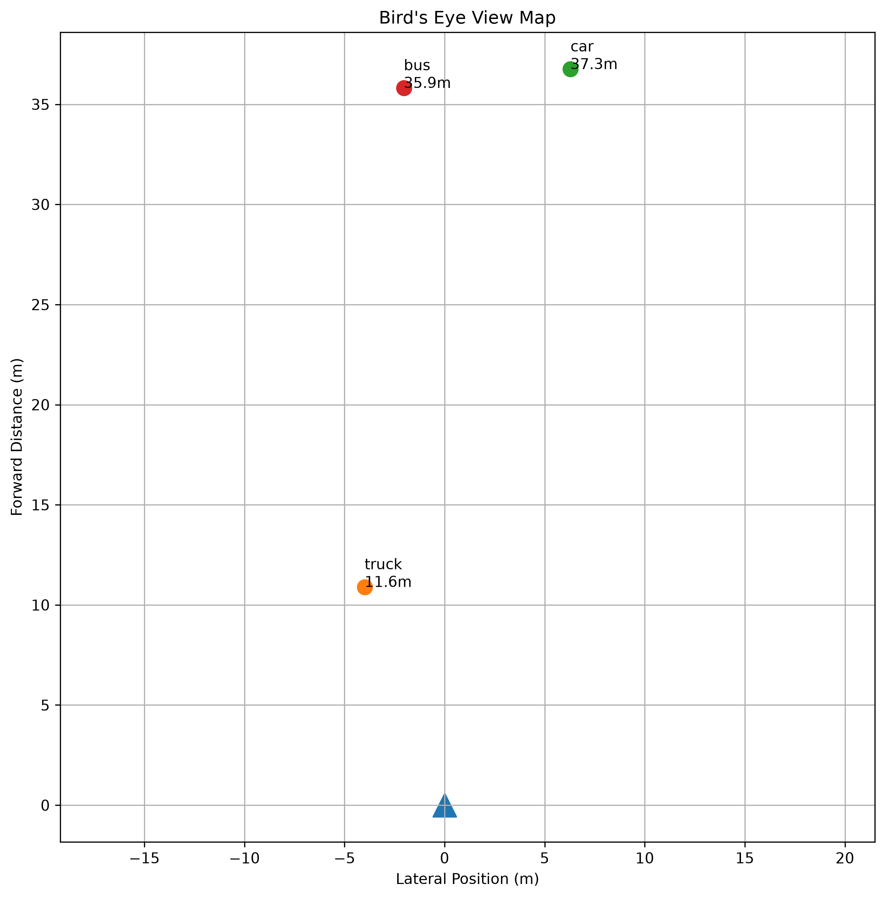
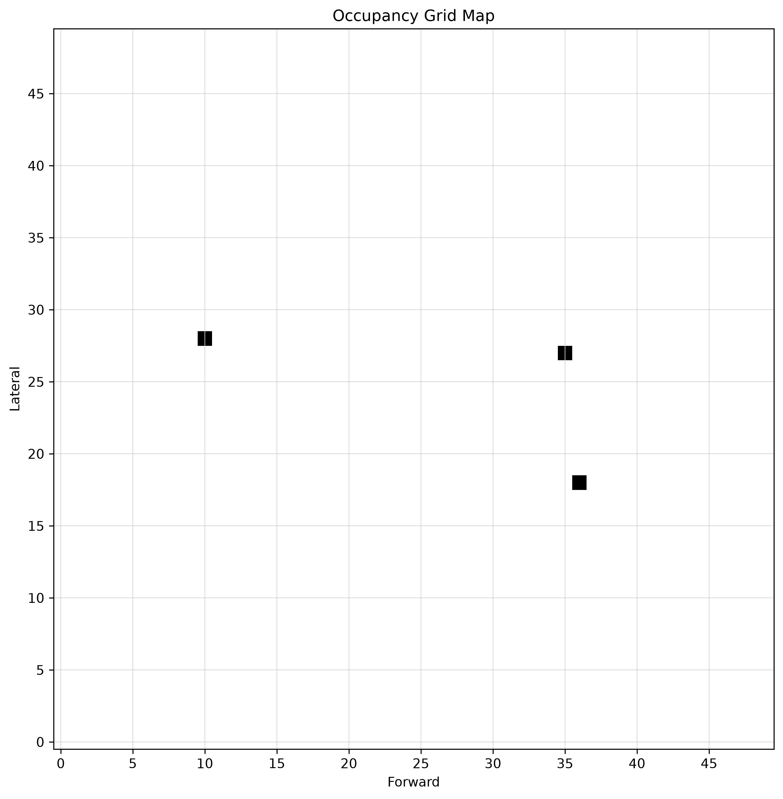
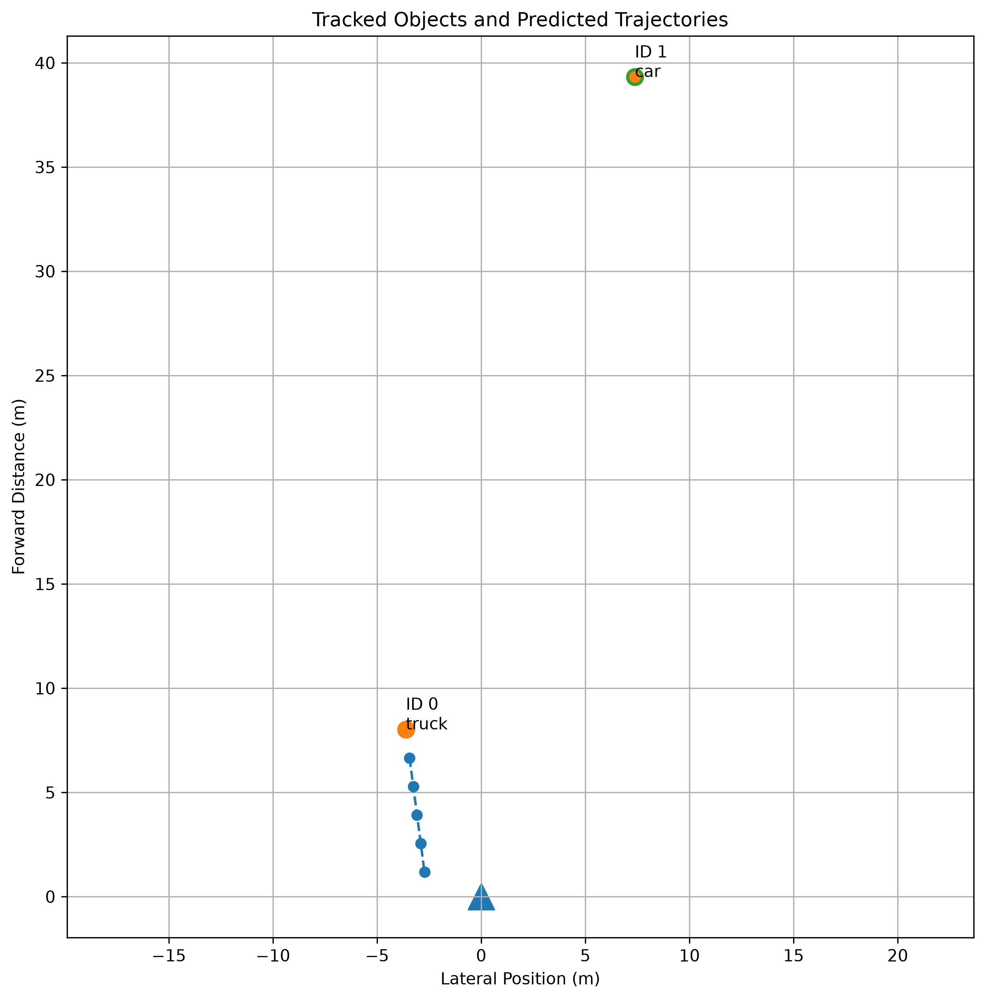
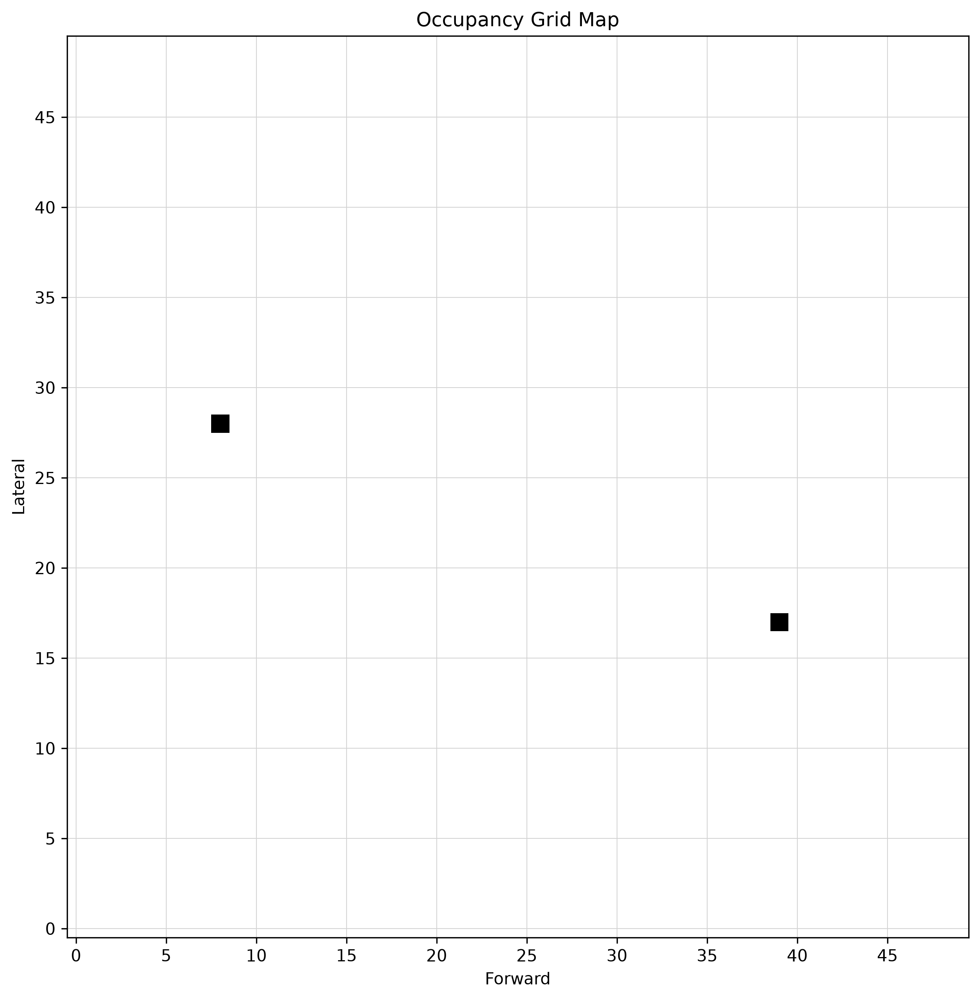

# Autonomous Perception Stack

An end-to-end autonomous vehicle perception project built on the nuScenes mini dataset. The stack combines camera segmentation, LiDAR projection, camera-LiDAR fusion, 3D localization, BEV mapping, occupancy mapping, multi-object tracking, trajectory prediction, and validation.

<<<<<<< HEAD
The project recreates the core perception pipeline used in modern autonomous driving systems by transforming raw multi-sensor data into a structured understanding of the surrounding environment.

---

## Overview

Autonomous vehicles must continuously answer three questions:

1. What objects exist around the vehicle?
2. Where are those objects located in 3D space?
3. Where are those objects likely to move next?

This project implements a complete perception stack that addresses all three problems using camera imagery and LiDAR point clouds from the nuScenes autonomous driving dataset.

The system performs:

* Camera-based object detection and segmentation
* LiDAR point cloud processing
* Camera-LiDAR sensor fusion
* Object localization and distance estimation
* Bird's-Eye-View scene generation
* Multi-object tracking

---

# Project Architecture
=======
The project turns raw synchronized camera and LiDAR data into structured scene understanding:
>>>>>>> e6859ca (Complete autonomous perception stack and final demo)

```text
nuScenes sample
   |
   |-- CAM_FRONT image --> YOLO segmentation
   |
   |-- LIDAR_TOP cloud --> LiDAR-to-camera projection
   |
   +--> camera-LiDAR fusion
          |
          +--> object geometry and localization
          +--> BEV and occupancy map
          +--> tracking
          +--> trajectory prediction
          +--> validation and final demo outputs
```

## Current Result

The final demo processes three consecutive nuScenes frames and produces tracked objects, trajectories, occupancy output, and a JSON summary.

Latest final-frame tracked objects:

```text
class   distance   points   length   width   height
truck   8.80 m     475      5.03 m   2.48 m  3.41 m
car     40.01 m    11       3.37 m   1.27 m  0.97 m
```

Sparse or geometrically invalid fused objects are still reported in validation summaries, but they are excluded from tracking and trajectory prediction.

## Output Gallery

### Camera Segmentation


### LiDAR Projection



### Camera-LiDAR Fusion


### Localization

The localization and BEV plots use the same display convention:

```text
x-axis = lateral position
y-axis = forward distance
```



### Bird's-Eye View



### Occupancy Grid

White cells are free space and black cells are occupied object cells.



### Final Demo Fusion


### Final Demo Trajectories



### Final Demo Occupancy



## Key Capabilities

### Camera Perception

Implemented in `src/perception/`.

The project uses an Ultralytics YOLO segmentation model to detect and segment road users in `CAM_FRONT` images. The local model resolver looks for `yolo11n-seg.pt` in the working directory and in `notebooks/`.

Output shape:

```python
{
    "class": "truck",
    "confidence": 0.77,
    "bbox": [x1, y1, x2, y2],
    "mask": mask
}
```

### LiDAR Projection

Implemented in `src/geometry/`.

The LiDAR projection pipeline:

```text
LIDAR_TOP points
   |
   +--> homogeneous coordinates
   +--> LiDAR calibration transform
   +--> camera calibration transform
   +--> camera intrinsic projection
   +--> image-plane u/v coordinates
```

The projection stage filters out points behind the camera and keeps `u`, `v`, `points_cam`, and `points_lidar` aligned.

### Camera-LiDAR Fusion

Implemented in `src/fusion/`.

Fusion associates projected LiDAR points with segmentation masks:

```text
YOLO mask
   |
projected LiDAR points inside mask
   |
point ownership by confidence
   |
DBSCAN largest-cluster cleanup
   |
fused object with 2D mask + 3D points
```

Important behavior:

* Road-user class filtering keeps objects such as `car`, `truck`, `bus`, `person`, `bicycle`, and `motorcycle`.
* `min_points=10` keeps distant cars while still rejecting extremely sparse detections.
* Each LiDAR point can belong to only one object.
* Fused objects preserve bounding boxes for visualization.

### Geometry Cleanup

Implemented in:

```text
src/fusion/cluster_filter.py
src/fusion/object_extraction.py
src/fusion/validation.py
```

DBSCAN keeps the largest compact LiDAR cluster inside each mask. Object dimensions are then computed in an object-aligned ground-plane frame:

```text
length = major PCA axis in ground plane
width  = minor PCA axis in ground plane
height = LiDAR Z range
```

This avoids confusing raw LiDAR axes with object length/width. For example, an angled truck can have its long side mostly along the raw lateral axis, but PCA still reports it as object length.

### Localization

Implemented in `src/localization/` and `src/fusion/object_extraction.py`.

Each valid fused object receives:

```python
{
    "centroid": np.ndarray,
    "distance": float,
    "position": {
        "x": lateral,
        "y": forward,
        "z": height
    },
    "dimensions": {
        "length": float,
        "width": float,
        "height": float
    }
}
```

For display, plots use:

```text
horizontal axis = lateral position
vertical axis   = forward distance
```

This means an object on the left side of the camera image appears left of the ego vehicle in localization and BEV plots.

### BEV Mapping and Occupancy

Implemented in `src/bev/`.

The project uses two BEV coordinate forms:

```text
Grid/storage:
    bev_x = forward
    bev_y = lateral

Plot/display:
    x-axis = lateral
    y-axis = forward
```

Occupancy mapping places tracked or fused objects into a 50x50 grid at 1 meter resolution.

### Multi-Object Tracking

Implemented in `src/tracking/`.

Tracking uses class-aware nearest-neighbor association across consecutive frames. Track state includes:

```python
{
    "track_id": int,
    "class": str,
    "centroid": np.ndarray,
    "velocity": np.ndarray,
    "age": int,
    "hits": int,
    "missed": int,
    "history": [...]
}
```

Tracks support missed-frame handling and pruning.

### Trajectory Prediction

Implemented in `src/prediction/`.

The trajectory predictor uses a constant-velocity model:

```text
future_position = current_position + velocity * dt * step
```

This is intentionally simple and interpretable. It is enough to demonstrate how tracked perception outputs can feed a prediction module.

### Validation

Implemented in `src/fusion/validation.py`.

Validation flags suspicious fused objects using point count and geometry checks:

```text
too few points
height too high or too low
length too large
width too small
```

Suspicious objects are kept in reports but excluded from final tracking and prediction. This protects the final demo from sparse LiDAR artifacts such as a distant car cluster producing unrealistic dimensions.

## Repository Structure

```text
autonomous-perception-stack/
|
|-- data/nuscenes/                 # nuScenes mini dataset
|-- notebooks/                     # week-by-week development notebooks
|   |-- 01_dataset_exploration.ipynb
|   |-- 02_coordinate_transforms.ipynb
|   |-- 03_camera_perception.ipynb
|   |-- 04_lidar_camera_fusion.ipynb
|   |-- 05_object_localization.ipynb
|   |-- 06_bev_mapping.ipynb
|   |-- 07_occupancy_mapping.ipynb
|   |-- 08_multi_object_tracking.ipynb
|   |-- 09_fusion_validation.ipynb
|   +-- yolo11n-seg.pt
|
|-- scripts/
|   +-- run_final_demo.py
|
|-- src/
|   |-- bev/
|   |-- fusion/
|   |-- geometry/
|   |-- localization/
|   |-- perception/
|   |-- pipeline/
|   |-- prediction/
|   |-- tracking/
|   +-- visualization/
|
|-- outputs/
|   |-- images/
|   +-- json/
|
|-- requirements.txt
+-- README.md
```

## Important Files

```text
src/pipeline/fusion_pipeline.py        Single-frame perception + projection + fusion
src/pipeline/final_demo_pipeline.py    Multi-frame final perception stack
scripts/run_final_demo.py              Reproducible final demo entry point
src/fusion/mask_fusion.py              Mask-to-LiDAR point association
src/fusion/cluster_filter.py           DBSCAN largest-cluster filtering
src/fusion/object_extraction.py        Centroids, distances, PCA dimensions
src/fusion/validation.py               Geometry quality checks
src/bev/coordinate_conversion.py       BEV/grid/plot coordinate conventions
src/tracking/tracker.py                Multi-object tracker
src/prediction/trajectory.py           Constant-velocity prediction
```

## Installation

Create and activate a virtual environment, then install dependencies:

```bash
python3 -m venv venv
source venv/bin/activate
pip install -r requirements.txt
```

The project expects nuScenes mini data at:

```text
data/nuscenes/
```

The local segmentation weights are expected at:

```text
notebooks/yolo11n-seg.pt
```

## Running The Project

### Run The Final Demo

```bash
MPLBACKEND=Agg PYTHONPATH=src venv/bin/python scripts/run_final_demo.py
```

This writes:

```text
outputs/images/final_demo_fusion.png
outputs/images/final_demo_trajectories.png
outputs/images/final_demo_occupancy.png
outputs/json/final_demo_summary.json
```

### Run A Source Sanity Check

```bash
PYTHONPATH=src venv/bin/python -m compileall src scripts
```

### Run Week 9 Validation Notebook

```bash
cd notebooks
MPLCONFIGDIR=/private/tmp/matplotlib-cache \
PYTHONPATH=../src \
../venv/bin/jupyter nbconvert \
  --to notebook \
  --execute \
  --ExecutePreprocessor.timeout=240 \
  --output /private/tmp/week9_executed.ipynb \
  09_fusion_validation.ipynb
```

## Final Demo JSON

The final JSON report stores:

```text
frames_processed
final_frame_summary
per-frame detections
raw fused object count
valid tracked object count
suspicious objects
tracked object states
predicted trajectories
```

Example:

```json
{
  "frames_processed": 3,
  "final_frame_summary": [
    {
      "class": "truck",
      "distance": 8.8,
      "num_points": 475,
      "length": 5.03,
      "width": 2.48,
      "height": 3.41
    },
    {
      "class": "car",
      "distance": 40.01,
      "num_points": 11,
      "length": 3.37,
      "width": 1.27,
      "height": 0.97
    }
  ]
}
```

## Known Limitations

This project is intentionally educational and transparent rather than production-grade.

Known limitations:

* YOLO is pretrained on generic classes, so occasional semantic mistakes can occur.
* Distant objects may have very few LiDAR points.
* Sparse LiDAR clusters can produce unstable dimensions.
* Tracking uses nearest-neighbor association, not a Kalman filter or learned tracker.
* Trajectory prediction uses constant velocity, not a behavioral forecasting model.
* Only the front camera and top LiDAR are used.

## Development Timeline

```text
Week 2   Camera perception
Week 3   LiDAR projection
Week 4   Camera-LiDAR fusion
Week 5   Object localization
Week 6   BEV mapping
Week 7   Geometry validation
Week 8   Fusion validation
Week 9   Geometry cleanup with DBSCAN
Week 10  Multi-object tracking
Week 11  Trajectory prediction
Week 12  Final AV perception demo
```

## Author

Ragul Narayanan Magesh

MS Data Analytics Engineering  
Northeastern University

GitHub: <https://github.com/ragulnarayanan>
